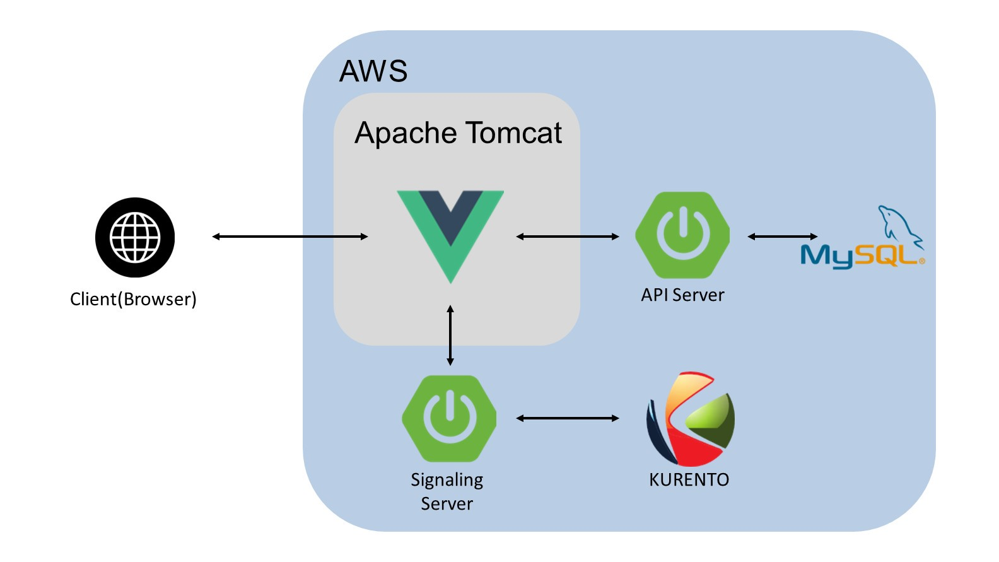
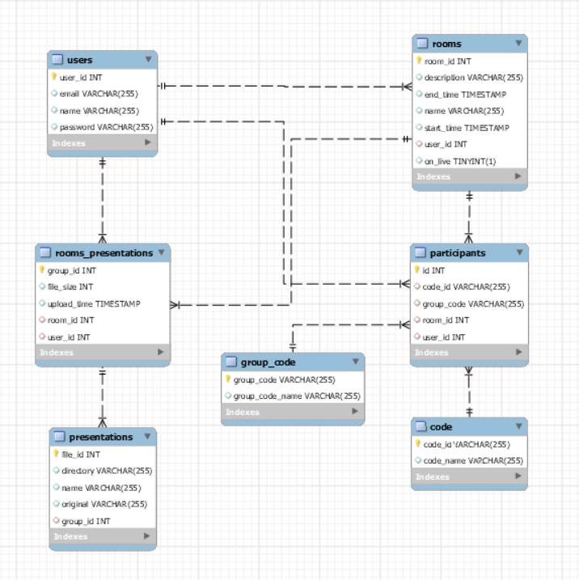

## 🏆 FOCUS
### 프로젝트 소개
  * [Focus HomePage](https://www.focuspresentation.com)(Chrome 브라우저 권장)
  * [YouTube](https://www.youtube.com/watch?v=RCCz8Ckgg8k)
  * [Notion 개발 WIKI](https://www.notion.so/7-FOCUS-a4db4765db0d47059f1a743e2e87347c)
  * ```FOCUS``` 는 온라인 발표환경과 오프라인 발표 환경의 차이를 줄이기 위해 화상영상에 발표자료를 함께 띄워서 제어하는 서비스입니다.
  * ```FOCUS``` 는 아이디어가 창의적이고, [SSAFY(Samsung Software Academy For Youth, 삼성 청년 소프트웨어 아카데미)](https://www.ssafy.com)에서 제공하는 스켈레톤 코드를 사용하지 않고 프로젝트를 진행하여 반출 허가를 받은 프로젝트입니다.

### 주요 기능
  * 발표자료 제어
      * 발표자는 방 정보 페이지에서 발표자료를 __업로드__ 할 수 있습니다.
      * 발표자는 미팅룸에서 발표자료를 선택할 수 있습니다.
      * 발표자는 미팅룸에서 발표자료의 __애니메이션__ 을 선택할 수 있습니다.
      * 발표자는 미팅룸에서 발표자료를 __넘길 수__ 있습니다.
  * 대시보드
      * 방은 Now, Future, History로 구분됩니다.
      
    * Now 그룹은 __시작시간 < 현재시간__ 인 방 목록을 보여줍니다.
    * Future 그룹은 __현재시간 < 시작시간__ 인 방 목록을 보여줍니다.
    * History 그룹은 __종료시간__ 이 존재하는 방 목록을 보여줍니다.
### 실행화면
* 발표자료 제어


* 대시보드


### 향후 계획
  * Secure 코딩
  * 다양한 상황에 대처하는 오류처리
  * 코드 스타일 개선
  * 마우스를 이용한 발표자료 위치 조정 및 사이즈 조절


## 📌 목차
- [시작하기](#시작하기)
  - [설치하기](#설치하기)
  - [실행하기](#실행하기)
  - [배포환경](#배포환경)
  - [배포하기](#배포하기)
- [역할](#역할)
- [프로젝트 명세](#프로젝트-명세)
  - [개발 환경](#개발-환경)
  - [시스템 아키텍처](#시스템-아키텍처)
  - [데이터베이스](#데이터베이스)
  - [핵심 라이브러리](#핵심-라이브러리)

- [디렉토리 구조](#디렉토리-구조)
- [서비스 상세](#서비스-상세)
  - [Controller](#Controller)
  - [WebSocket](#WebSocket)
  - [Router](#Router)
  - [사용자 시나리오](#사용자-시나리오)
  - [기타 라이브러리](#기타-라이브러리)


## 시작하기
### 실행환경
* java 1.8.0_301
* maven 3.8.1 
* lombok 1.18.20
* npm 6.14.13
* Eclipse STS 3.9.17
* Intellij 2021.1.3
* VisualStudioCode 1.59.0
* Chrome 92.0

### 배포환경
- __URL__ : https://www.focuspresentation.com
- __배포 환경__ : spring-boot-starter-tomcat-2.5.3(tomcat-embed-core 9.0.50)
- __HTTPS 적용__ : O 
- __PORT__ : 8443 (80/443 -> 8443 Port Forwarding)

### 배포하기

- [KMS Setting](documents/21-09-02_KMS_Setting.md)

* [Deploy & Build](documents/21-09-02_Focus_Deploy&Build.md)

## 역할
### 김민지(BE)
* Kurento MCU
* Room API
* JPQL
* 문서 정리
### 김애은(BE)
* JPA, JPQL
* User, Room, File API
* Controller, Service
* 문서 정리
### 손동우(BE)
* Kurento MCU
* Socket Message
* File API
* 문서 정리
### 우만승(FE)
* Kurento Utils
* 미팅룸
* 발표자료 제어
### 정진주(FE)
* 회원관리
* 대시보드
* 영상제작

## 프로젝트 명세

### 개발 환경
#### Front-end

- HTML5, CSS3, JS(ES6)
- Bootstrap5
- Vue.js, Vuex
- Visual Studio Code


#### Back-end
- Java
- Spring Boot, Spring MVC, Spring Data JPA
- JPA, JPQL
- Maven
- MySQL
- Intellij, Eclipse STS

#### DevOps

- AWS EC2
- Apache Tomcat

#### Collaboration
- Jira
- Gitlab, Sourcetree, GithubDesktop
- Mattermost
- [Notion](https://www.notion.so/7-FOCUS-a4db4765db0d47059f1a743e2e87347c)


### System Architecture



### Database


### 핵심 라이브러리
- __Kurento MCU 서버__
  - __링크__ : https://doc-kurento.readthedocs.io/en/latest/tutorials/java/tutorial-groupcall.html
  - __소개__ : Kurento는 WebRTC 미디어 서버이자 WWW 및 스마트폰 플랫폼용 비디오 애플리케이션 개발을 간단하게 해주는 클라이언트 API입니다.
  - __사용 기능__ : Group Call 기능
- __Kurento-Utils__
    -  __소개__ :브라우저의 WebRTC API를 제어하기 위해 RTCPeerConnection 객체의 생성 및 처리를 단순화하는 데 사용된 자바스크립트 기반의 Kurento 유틸리티 라이브러리.
    -  __사용 기능__ : 발표 자료 제어

## 디렉토리 구조
### Frontend
* [보러가기✔](documents/21-08-18_프론트엔드_디렉토리_구조.md)
### Backend
* [보러가기✔](documents/21-08-18_백엔드_디렉토리_구조.md)

## 서비스 상세
### Controller 
* [보러가기✔](documents/21-08-19_Controller.md)
### WebSocket
* [보러가기✔](documents/21-08-20_Kurento_WebSocket_Message.md)
### Component
* [보러가기✔](documents/21-08-19_FrontendComponent.md)
### 사용자 시나리오
* [보러가기✔](exec/시연시나리오.pdf)
### 기타 라이브러리
* [보러가기✔](documents/21-08-18_기타_라이브러리.md)

